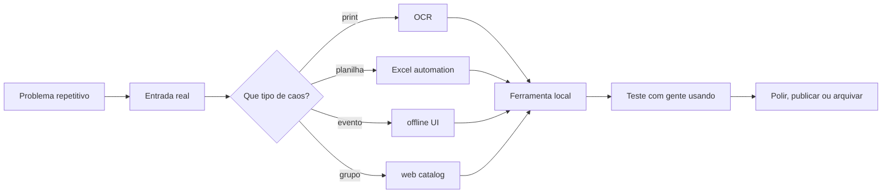

---

## `whoami`

Sou o **Brennin**, desenvolvedor **full-stack** com foco em **ferramentas locais**, **automação**, **apps desktop**, **interfaces web** e projetos para comunidade.

Meu território é onde um problema real ainda está sendo resolvido no improviso: print, planilha, WhatsApp, palco, escala, jogo do grupo, rotina repetitiva. Eu gosto de transformar isso em software simples o bastante para usar e sólido o bastante para confiar.

```txt
perfil: full-stack builder
modo: local-first quando faz sentido
stack: Python · TypeScript · C# · Java · JavaScript
nicho: desktop tools · church tech · game labs · automação local
regra: ferramenta boa é a que alguém realmente usa
```


---

## Manifesto local-first

Eu não parto da ideia de colocar tudo na nuvem. Primeiro eu pergunto: **isso precisa mesmo depender de internet, API paga ou infraestrutura externa?**


| Princípio                         | Como aparece nos projetos                                        |
| --------------------------------- | ---------------------------------------------------------------- |
| **Offline quando dá**             | Relógio de palco, ferramentas Windows, automações locais         |
| **Entrada bagunçada, saída útil** | OCR de print, planilha pronta, fluxo manual reduzido             |
| **Usável antes de bonito**        | Primeiro resolve. Depois ganha layout, empacotamento e polimento |
| **Cloud só quando agrega**        | Se a web ajuda colaboração, publicação ou acesso, ela entra      |
| **Projeto com contexto real**     | Igreja, trabalho, games, comunidade e tarefas repetitivas        |


---

## Builds que explicam meu perfil


|                                                                                                                                                    |                                                                                                                                                                                                                                                     |
| -------------------------------------------------------------------------------------------------------------------------------------------------- | --------------------------------------------------------------------------------------------------------------------------------------------------------------------------------------------------------------------------------------------------- |
| horafolio**OCR + desktop · privado / WIP**Print do Banco de Horas entra. Timesheet Excel sai.`Python` `PySide6` `Tesseract OCR` `Excel`         | [amigos-database](https://github.com/CarvalhoBrennin/amigos-database)**Web / comunidade · público**Catálogo de jogos cooperativos para quando o grupo quer jogar, mas ninguém quer perder tempo decidindo.`TypeScript` `SPA` `Front-end` `Games` |
| Zipper**Utilitário Windows · privado / lab**Ferramenta de bancada para empacotamento, fluxo local e rotina de arquivos.`C#` `Windows` `Desktop` | relogio-mateus24**Church tech · privado / uso real**Relógio cênico offline para evento, palco e operação local.`Offline-first` `Eventos` `Operação`                                                                                              |
| sunion**Game / modding · privado / lab**Mod Minecraft como laboratório de Java, NeoForge e mecânicas de gameplay.`Java` `NeoForge` `Minecraft`  | transformados-***Comunidade / igreja · privado**Projetos para ministério, organização, presença digital e apoio a pessoas reais.`Web` `Comunidade` `Propósito`                                                                                   |


> Enquanto parte dos projetos ainda está privada, este perfil funciona como mapa do laboratório: mostra o tipo de problema que eu gosto de resolver e o tipo de ferramenta que eu costumo construir.

---

## Projeto público em destaque


|     |                                                                                                                                                                                                                                                                                                                                                    |
| --- | -------------------------------------------------------------------------------------------------------------------------------------------------------------------------------------------------------------------------------------------------------------------------------------------------------------------------------------------------- |
|     | amigos-database**Catálogo de jogos cooperativos** para organizar o caos da call antes da jogatina.**Resolve:** escolha de jogo por plataforma, quantidade de jogadores, gênero e contexto.**Mostra:** gosto por ferramentas simples, comunidade e produto com uso real.[Abrir repositório](https://github.com/CarvalhoBrennin/amigos-database) |


---

## Local tools & automations




O padrão que mais se repete nos meus projetos:

```txt
coisa chata -> protótipo -> ferramenta usável -> teste real -> polimento seletivo
```

---

## Stack map


| Camada                  | Ferramentas                                                   |
| ----------------------- | ------------------------------------------------------------- |
| **Linguagens**          | Python · TypeScript · JavaScript · C# · Java                  |
| **Web**                 | React · Vite · Svelte · Tailwind CSS                          |
| **Desktop & automação** | PySide6/Qt · Tesseract OCR · Excel automation · Windows tools |
| **Game/modding**        | Java · NeoForge · protótipos de comunidade                    |
| **Fluxo de trabalho**   | Git · Docker · SQL Server · Azure DevOps                      |


---

## Timeline de builds

```txt
2026.03  perfil criado, laboratório aberto
2026.04  projetos privados começam a virar ferramentas de uso real
2026.05  amigos-database público como vitrine de comunidade + web
2026.06  foco em horafolio, OCR local, desktop apps e polimento de perfil
next     publicar 1 ferramenta forte: horafolio, Zipper ou relogio-mateus24
```

---

## Agora no radar

```txt
[em foco]       horafolio :: Banco de Horas -> timesheet Excel
[explorando]    UIs desktop modernas com Qt/PySide6
[lapidando]     README como dev landing page, não só vitrine de badges
[side quests]   igreja, eventos, games, modding e automação local
[próximo ship]  tornar público um projeto local-first com demo clara
```

---

**GitHub telemetry**

  


---

## Contato

Aberto a oportunidades em **desenvolvimento full-stack**, **ferramentas locais**, **automação**, **desktop apps** e projetos com propósito prático.

- **GitHub:** [github.com/CarvalhoBrennin](https://github.com/CarvalhoBrennin)
- **LinkedIn:** [editar link](#)
- **Email:** [editar email](mailto:seuemail@dominio.com)
- **Portfólio:** [editar site](#)

```txt
local-first > cloud hype
menos dependência, mais controle
buildando em silêncio, publicando quando fizer sentido
```

