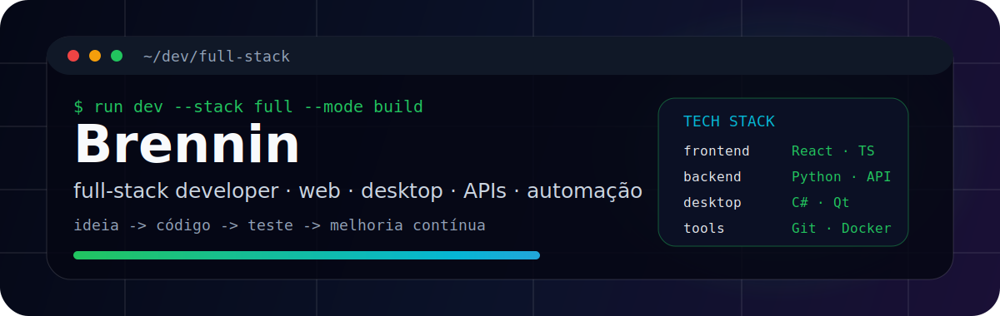
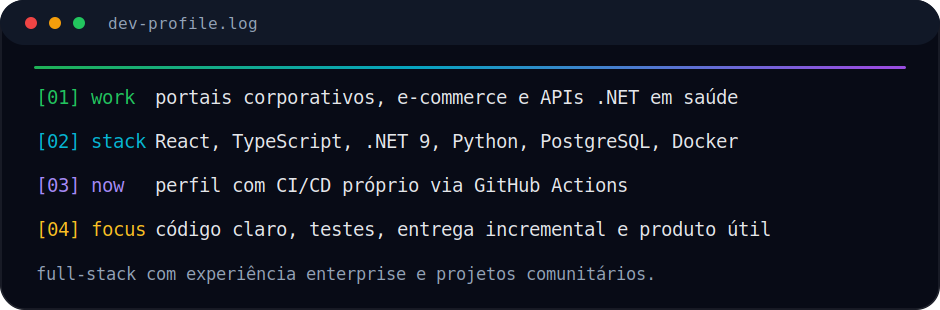

<p align="center">
  
</p>

<p align="center">
  <a href="https://github.com/CarvalhoBrennin?tab=repositories"></a>
</p>

<p align="center">
  
</p>

---

## Sobre

Sou o **Brennin**, desenvolvedor **full-stack** que atua entre **front-end**, **back-end**, **APIs**, **desktop** e **automação** — escolhendo a stack certa para cada problema, com foco em código legível, entrega incremental e software que funciona no mundo real.

```txt
perfil: full-stack developer
foco: produto útil, arquitetura clara, testes e manutenção
stack: TypeScript · React · Python · C# · .NET · JavaScript
ambiente: web · desktop · APIs · Docker · Azure DevOps
```

<p align="center">
  
</p>

---

## Experiência profissional

Desenvolvedor full-stack em **operadora de planos odontológicos**, atuando em produtos digitais corporativos com requisitos de negócio, segurança e compliance.

- **E-commerce regulado** — catálogo, checkout, portais de titular/parceiro e área administrativa (React, NestJS/Express, PostgreSQL, Docker)
- **Portais web corporativos** — beneficiário, dentista, auditoria e empresa (React, TypeScript, TanStack Query)
- **APIs em ASP.NET Core (.NET 9)** — autenticação, domínio, integrações e testes automatizados
- **Fluxo de entrega** — Git, Azure DevOps, documentação técnica e trabalho em ambiente enterprise

> Código proprietário em repositórios internos; o perfil destaca capacidade técnica sem expor implementações privadas.

---

## Projetos em destaque

<table>
  <tr>
    <td width="33%" valign="top">
      <h3><a href="https://github.com/CarvalhoBrennin/AM">AM</a></h3>
      <p><strong>Web · comunidade</strong></p>
      <p>Plataforma web da linha AMIGOS — experiências digitais, conteúdo e ferramentas para uso comunitário.</p>
      <p><code>TypeScript</code> <code>React</code> <code>Vite</code> <code>SPA</code></p>
    </td>
    <td width="33%" valign="top">
      <h3><a href="https://github.com/CarvalhoBrennin/amigos-database">amigos-database</a></h3>
      <p><strong>Web · catálogo · público</strong></p>
      <p>SPA de jogos cooperativos e browser games com filtros, i18n, integração de preços e testes E2E.</p>
      <p><code>React 18</code> <code>TypeScript</code> <code>Tailwind</code> <code>Vitest</code> <code>Playwright</code></p>
    </td>
    <td width="33%" valign="top">
      <h3><a href="https://github.com/CarvalhoBrennin/Transformados">Transformados</a></h3>
      <p><strong>Web · comunidade</strong></p>
      <p>Projetos digitais para ministério e organização: presença online, ferramentas internas e apoio operacional.</p>
      <p><code>React</code> <code>TypeScript</code> <code>Web</code> <code>Comunidade</code></p>
    </td>
  </tr>
</table>

<table>
  <tr>
    <td width="45%">
      <a href="https://github.com/CarvalhoBrennin/amigos-database">
        
      </a>
    </td>
    <td width="55%" valign="top">
      <h3>amigos-database</h3>
      <p>Catálogo SPA de jogos cooperativos com navegação fluida, filtros, modalidades, i18n multi-idioma e integração com conversores de preço.</p>
      <p><strong>Destaques:</strong> cobertura de testes, auditoria de dependências, sitemap automático e deploy estático.</p>
      <p><a href="https://github.com/CarvalhoBrennin/amigos-database">Abrir repositório</a></p>
    </td>
  </tr>
</table>

---

## Como eu penso software

<table>
  <tr>
    <td width="50%" valign="top"><strong>Resolver antes de complicar</strong><br />Entender o problema, prototipar, iterar com feedback real.</td>
    <td width="50%" valign="top"><strong>Código legível</strong><br />Nomes claros, estrutura simples e manutenção em mente desde o início.</td>
  </tr>
  <tr>
    <td width="50%" valign="top"><strong>Stack consciente</strong><br />Web, desktop ou API — o que fizer mais sentido para o contexto.</td>
    <td width="50%" valign="top"><strong>Qualidade contínua</strong><br />Testes, lint, typecheck e documentação como parte do fluxo.</td>
  </tr>
</table>

```txt
ideia -> protótipo -> implementação -> teste -> entrega -> melhoria
```

---

## Stack & ferramentas

<p>
  
  
  
  
  
  
  
  
  
</p>

<table>
  <tr>
    <td width="50%" valign="top">
      <strong>Front-end</strong><br />
      React · TypeScript · Vite · Tailwind CSS · TanStack Query · Zustand
    </td>
    <td width="50%" valign="top">
      <strong>Back-end</strong><br />
      ASP.NET Core · NestJS/Express · Python · REST APIs · JWT
    </td>
  </tr>
  <tr>
    <td width="50%" valign="top">
      <strong>Desktop & scripts</strong><br />
      C# · PySide6/Qt · Tauri · automação local
    </td>
    <td width="50%" valign="top">
      <strong>Qualidade & entrega</strong><br />
      Vitest · Playwright · xUnit · Git · Azure DevOps · Docker
    </td>
  </tr>
</table>

---

## Diferenciais

- **Full-stack de verdade** — do portal corporativo ao utilitário desktop
- **Produto com testes** — unitários, E2E e cobertura onde faz sentido
- **Contexto enterprise** — autenticação, integrações, compliance e múltiplos portais
- **Projetos comunitários** — ferramentas web pensadas para uso real por pessoas reais

---

<details>
  <summary><strong>GitHub stats</strong></summary>

  <br />

  <p align="center">
    
    
  </p>

</details>

---

## Contato

Aberto a conversas sobre **desenvolvimento de software**, **colaboração em projetos** e **oportunidades na área de tecnologia**.

- **GitHub:** [github.com/CarvalhoBrennin](https://github.com/CarvalhoBrennin)
- **Repositórios:** [ver projetos](https://github.com/CarvalhoBrennin?tab=repositories)

```txt
construir > complicar
testar > adivinhar
software bom é o que funciona e se mantém
```
