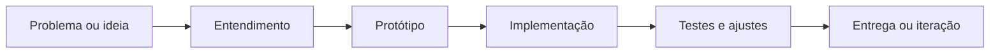

<p align="center">
  
</p>

<p align="center">
  <a href="https://github.com/CarvalhoBrennin?tab=repositories"></a>
</p>

<p align="center">
  
</p>

---

## `whoami`

Sou o **Brennin**, desenvolvedor **full-stack** interessado em **tecnologia aplicada**: transformar ideias em software que funciona no dia a dia.

Gosto de trabalhar entre **front-end**, **back-end**, **desktop** e **automação** — escolhendo a ferramenta certa para cada problema, em vez de forçar sempre a mesma stack ou a mesma arquitetura.

```txt
perfil: full-stack developer
foco: software prático, bem estruturado e fácil de manter
stack: Python · TypeScript · C# · Java · JavaScript
interesse: web · desktop · APIs · automação · boas práticas
```

<p align="center">
  
</p>

---

## Como eu penso software

| Princípio | Na prática |
|---|---|
| **Resolver antes de complicar** | Entender o problema, prototipar, iterar |
| **Código legível** | Nomes claros, estrutura simples, manutenção em mente |
| **Escolha consciente de stack** | Web, desktop ou script — o que fizer mais sentido |
| **Offline quando possível** | Menos dependência externa, mais controle |
| **Aprendizado contínuo** | Novas linguagens, frameworks e ferramentas fazem parte do processo |

---

## Áreas de atuação

<table>
  <tr>
    <td width="50%" valign="top">
      <h3>Web & front-end</h3>
      <p>Interfaces modernas, SPAs e experiências responsivas.</p>
      <p><code>TypeScript</code> <code>React</code> <code>Vite</code> <code>JavaScript</code></p>
    </td>
    <td width="50%" valign="top">
      <h3>Back-end & APIs</h3>
      <p>Lógica de negócio, integrações e serviços bem definidos.</p>
      <p><code>Python</code> <code>APIs</code> <code>SQL</code> <code>Docker</code></p>
    </td>
  </tr>
  <tr>
    <td width="50%" valign="top">
      <h3>Desktop & automação</h3>
      <p>Ferramentas locais, produtividade e rotinas repetitivas automatizadas.</p>
      <p><code>C#</code> <code>Python</code> <code>Qt/PySide6</code> <code>Windows</code></p>
    </td>
    <td width="50%" valign="top">
      <h3>Exploração & experimentação</h3>
      <p>Projetos pessoais, game dev, modding e laboratório de novas ideias.</p>
      <p><code>Java</code> <code>Git</code> <code>Open source</code> <code>Side projects</code></p>
    </td>
  </tr>
</table>

---

## Fluxo de trabalho



```txt
ideia -> protótipo -> código -> teste -> melhoria contínua
```

---

## Stack & ferramentas

<p>
  
  
  
  
  
  
  
  
  
</p>

| Camada | Tecnologias |
|---|---|
| **Linguagens** | Python · TypeScript · JavaScript · C# · Java |
| **Web** | React · Vite · HTML · CSS |
| **Desktop & scripts** | PySide6/Qt · C# · automação local |
| **Infra & dados** | Git · Docker · SQL Server |
| **Workflow** | GitHub · Azure DevOps · documentação clara |

---

## Explorando agora

```txt
[web]           React, TypeScript e arquitetura de front-end
[desktop]       apps nativos e ferramentas locais
[backend]       APIs, integrações e persistência de dados
[devops]        Git, Docker e fluxo de entrega
[always]        código limpo, projetos reais e aprendizado constante
```

---

<details>
  <summary><strong>GitHub stats</strong></summary>

  <br />

  <p align="center">
    
    
  </p>

</details>

---

## Contato

Aberto a conversas sobre **desenvolvimento de software**, **colaboração em projetos** e **oportunidades na área de tecnologia**.

- **GitHub:** [github.com/CarvalhoBrennin](https://github.com/CarvalhoBrennin)
- **Repositórios:** [ver projetos](https://github.com/CarvalhoBrennin?tab=repositories)

```txt
construir > complicar
aprender > parar
software bom é o que funciona e se mantém
```
