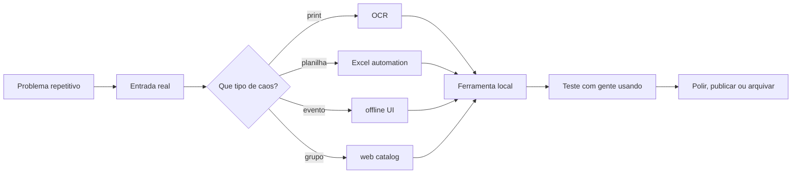

<p align="center">
  
</p>

<p align="center">
  <a href="https://github.com/CarvalhoBrennin?tab=repositories"></a>
  <a href="#"></a>
  <a href="mailto:seuemail@dominio.com"></a>
  <a href="#"></a>
</p>

<p align="center">
  
</p>

---

## `whoami`

Sou o **Brennin**, desenvolvedor **full-stack** com foco em **ferramentas locais**, **automação**, **apps desktop**, **interfaces web** e projetos para comunidade.

Meu território é onde um problema real ainda está sendo resolvido no improviso: print, planilha, WhatsApp, palco, escala, jogo do grupo, rotina repetitiva. Eu gosto de transformar isso em software simples o bastante para usar e sólido o bastante para confiar.

```txt
perfil: full-stack builder
modo: local-first quando faz sentido
stack: Python · TypeScript · C# · Java · JavaScript
nicho: desktop tools · church tech · game labs · automação local
regra: ferramenta boa é a que alguém realmente usa
```

<p align="center">
  
</p>

---

## Manifesto local-first

Eu não parto da ideia de colocar tudo na nuvem. Primeiro eu pergunto: **isso precisa mesmo depender de internet, API paga ou infraestrutura externa?**

| Princípio | Como aparece nos projetos |
|---|---|
| **Offline quando dá** | Relógio de palco, ferramentas Windows, automações locais |
| **Entrada bagunçada, saída útil** | OCR de print, planilha pronta, fluxo manual reduzido |
| **Usável antes de bonito** | Primeiro resolve. Depois ganha layout, empacotamento e polimento |
| **Cloud só quando agrega** | Se a web ajuda colaboração, publicação ou acesso, ela entra |
| **Projeto com contexto real** | Igreja, trabalho, games, comunidade e tarefas repetitivas |

---

## Builds que explicam meu perfil

<table>
  <tr>
    <td width="50%" valign="top">
      <h3>horafolio</h3>
      <p><strong>OCR + desktop · privado / WIP</strong></p>
      <p>Print do Banco de Horas entra. Timesheet Excel sai.</p>
      <p><code>Python</code> <code>PySide6</code> <code>Tesseract OCR</code> <code>Excel</code></p>
    </td>
    <td width="50%" valign="top">
      <h3><a href="https://github.com/CarvalhoBrennin/amigos-database">amigos-database</a></h3>
      <p><strong>Web / comunidade · público</strong></p>
      <p>Catálogo de jogos cooperativos para quando o grupo quer jogar, mas ninguém quer perder tempo decidindo.</p>
      <p><code>TypeScript</code> <code>SPA</code> <code>Front-end</code> <code>Games</code></p>
    </td>
  </tr>
  <tr>
    <td width="50%" valign="top">
      <h3>Zipper</h3>
      <p><strong>Utilitário Windows · privado / lab</strong></p>
      <p>Ferramenta de bancada para empacotamento, fluxo local e rotina de arquivos.</p>
      <p><code>C#</code> <code>Windows</code> <code>Desktop</code></p>
    </td>
    <td width="50%" valign="top">
      <h3>relogio-mateus24</h3>
      <p><strong>Church tech · privado / uso real</strong></p>
      <p>Relógio cênico offline para evento, palco e operação local.</p>
      <p><code>Offline-first</code> <code>Eventos</code> <code>Operação</code></p>
    </td>
  </tr>
  <tr>
    <td width="50%" valign="top">
      <h3>sunion</h3>
      <p><strong>Game / modding · privado / lab</strong></p>
      <p>Mod Minecraft como laboratório de Java, NeoForge e mecânicas de gameplay.</p>
      <p><code>Java</code> <code>NeoForge</code> <code>Minecraft</code></p>
    </td>
    <td width="50%" valign="top">
      <h3>transformados-*</h3>
      <p><strong>Comunidade / igreja · privado</strong></p>
      <p>Projetos para ministério, organização, presença digital e apoio a pessoas reais.</p>
      <p><code>Web</code> <code>Comunidade</code> <code>Propósito</code></p>
    </td>
  </tr>
</table>

> Enquanto parte dos projetos ainda está privada, este perfil funciona como mapa do laboratório: mostra o tipo de problema que eu gosto de resolver e o tipo de ferramenta que eu costumo construir.

---

## Projeto público em destaque

<table>
  <tr>
    <td width="45%">
      <a href="https://github.com/CarvalhoBrennin/amigos-database">
        
      </a>
    </td>
    <td width="55%">
      <h3>amigos-database</h3>
      <p><strong>Catálogo de jogos cooperativos</strong> para organizar o caos da call antes da jogatina.</p>
      <p><strong>Resolve:</strong> escolha de jogo por plataforma, quantidade de jogadores, gênero e contexto.</p>
      <p><strong>Mostra:</strong> gosto por ferramentas simples, comunidade e produto com uso real.</p>
      <p><a href="https://github.com/CarvalhoBrennin/amigos-database">Abrir repositório</a></p>
    </td>
  </tr>
</table>

---

## Local tools & automations



O padrão que mais se repete nos meus projetos:

```txt
coisa chata -> protótipo -> ferramenta usável -> teste real -> polimento seletivo
```

---

## Stack map

<p>
  
  
  
  
  
  
  
  
  
  
</p>

| Camada | Ferramentas |
|---|---|
| **Linguagens** | Python · TypeScript · JavaScript · C# · Java |
| **Web** | React · Vite · Svelte · Tailwind CSS |
| **Desktop & automação** | PySide6/Qt · Tesseract OCR · Excel automation · Windows tools |
| **Game/modding** | Java · NeoForge · protótipos de comunidade |
| **Fluxo de trabalho** | Git · Docker · SQL Server · Azure DevOps |

---

## Timeline de builds

```txt
2026.03  perfil criado, laboratório aberto
2026.04  projetos privados começam a virar ferramentas de uso real
2026.05  amigos-database público como vitrine de comunidade + web
2026.06  foco em horafolio, OCR local, desktop apps e polimento de perfil
next     publicar 1 ferramenta forte: horafolio, Zipper ou relogio-mateus24
```

---

## Agora no radar

```txt
[em foco]       horafolio :: Banco de Horas -> timesheet Excel
[explorando]    UIs desktop modernas com Qt/PySide6
[lapidando]     README como dev landing page, não só vitrine de badges
[side quests]   igreja, eventos, games, modding e automação local
[próximo ship]  tornar público um projeto local-first com demo clara
```

---

<details>
  <summary><strong>GitHub telemetry</strong></summary>

  <br />

  <p align="center">
    
    
  </p>

</details>

---

## Contato

Aberto a oportunidades em **desenvolvimento full-stack**, **ferramentas locais**, **automação**, **desktop apps** e projetos com propósito prático.

- **GitHub:** [github.com/CarvalhoBrennin](https://github.com/CarvalhoBrennin)
- **LinkedIn:** [editar link](#)
- **Email:** [editar email](mailto:seuemail@dominio.com)
- **Portfólio:** [editar site](#)

```txt
local-first > cloud hype
menos dependência, mais controle
buildando em silêncio, publicando quando fizer sentido
```

<!--
Notas para personalizar:
1. Troque LinkedIn, email e portfolio no topo e na seção Contato.
2. Se quiser usar como perfil de contratação, remova o Typing SVG e mantenha GitHub telemetry fechado.
3. Quando horafolio, Zipper, relogio-mateus24 ou sunion ficarem públicos, troque os cards privados por links reais.
4. O banner está em ./assets/banner.svg e o card de terminal em ./assets/terminal-card.svg.
-->
