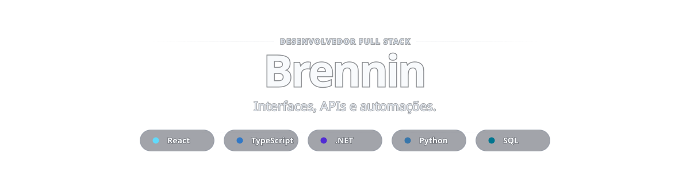
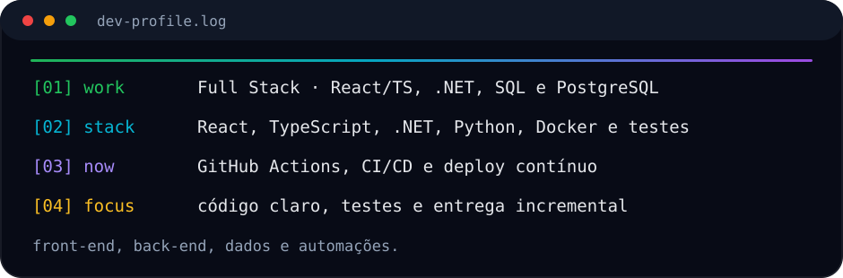
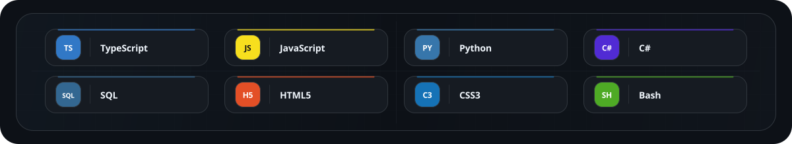
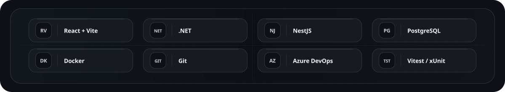

<p align="center">
  
</p>

---

## Sobre

Desenvolvedor **Full Stack** com foco em interfaces, APIs, automações e dados. Trabalho com **React**, **TypeScript**, **.NET**, **SQL Server** e **PostgreSQL**, conectando produto, código e entrega de ponta a ponta.

<p align="center">
  
</p>

## Atualmente

- Desenvolvimento full stack na **OKTA7**, atuando em interfaces com **React/TypeScript**, APIs em **.NET**, integrações e camada de dados com **SQL Server** e **PostgreSQL**.
- Atuação em plataforma corporativa de grande escala, com fluxos integrados, contexto regulatório e sistemas de uso interno.
- Manutenção do [amigos-database](https://github.com/CarvalhoBrennin/amigos-database), SPA pública com filtros, i18n, integração de preços, testes E2E e deploy contínuo.

---

## Experiência profissional

### OKTA7 · Desenvolvedor Full Stack
**set. 2025 – atual** · Alphaville, SP

- Desenvolvimento de interfaces responsivas com **React** e **TypeScript** em plataforma corporativa de grande escala.
- Criação e manutenção de **APIs em ASP.NET Core (.NET)**, cobrindo endpoints, regras de negócio e integrações entre sistemas.
- Trabalho com **SQL Server** e **PostgreSQL** em consultas, modelagem, persistência e ajustes de fluxos entre front-end, API e banco de dados.

### OKTA7 · Analista de Infraestrutura Júnior
**ago. 2025 – set. 2025** · Alphaville, SP

- Gestão de ciclo de vida de máquinas, provisionamento, devoluções e suporte a equipes remotas.
- Atendimento de chamados, documentação de correções e apoio em onboarding técnico.

### Química na Veia · Desenvolvedor Full Stack *(freelance)*
**jun. 2022 – dez. 2023** · Remoto

- Desenvolvimento de plataforma EAD em **PHP**, com gestão de aulas, controle de acesso e área de alunos.
- Construção de interfaces e fluxos administrativos com foco em clareza, manutenção e uso real.

---

## Projetos em destaque

<table>
  <tr>
    <td width="50%" valign="top">
      <h3>amigos-database</h3>
      <p>SPA pública de jogos cooperativos e browser games, com filtros, i18n, integração de preços, testes unitários, cobertura e E2E.</p>
      <p><code>React 18</code> <code>TypeScript</code> <code>Tailwind</code> <code>Vitest</code> <code>Playwright</code></p>
      <p><a href="https://github.com/CarvalhoBrennin/amigos-database">Ver repositório</a></p>
    </td>
    <td width="50%" valign="top">
      <h3>Projetos profissionais e privados</h3>
      <p>Interfaces, APIs, automações e ferramentas internas desenvolvidas em contextos corporativos, educacionais e operacionais.</p>
      <p><code>React</code> <code>.NET</code> <code>SQL Server</code> <code>PostgreSQL</code> <code>PHP</code></p>
      <p>Detalhes técnicos disponíveis conforme contexto e autorização.</p>
    </td>
  </tr>
</table>

---

## Como trabalho

- Entendimento antes da implementação: contexto, problema, restrições e impacto esperado.
- Código claro e sustentável: nomes objetivos, estrutura simples e decisões fáceis de manter.
- Entrega incremental: validar, implementar, testar, revisar e evoluir com feedback.
- Visão ponta a ponta: interface, API, banco, integrações, automações e documentação.

```txt
entender -> validar -> implementar -> testar -> entregar -> evoluir
```

---

## Stack

### Linguagens

Linguagens usadas em interfaces, APIs, automações, dados e estruturação web.

<p align="center">
  
</p>

### Ferramentas

Frameworks, bancos e ferramentas de desenvolvimento, testes, versionamento e entrega.

<p align="center">
  
</p>

---

## Contribuições

Animação da grade de contribuições gerada automaticamente pelo workflow do repositório e publicada na branch `output`.

<p align="center">
  <picture>
    <source media="(prefers-color-scheme: dark)" srcset="https://raw.githubusercontent.com/CarvalhoBrennin/CarvalhoBrennin/output/snake-dark.svg" />
    <source media="(prefers-color-scheme: light)" srcset="https://raw.githubusercontent.com/CarvalhoBrennin/CarvalhoBrennin/output/snake-light.svg" />
    
  </picture>
</p>

---

## Contato

Aberto a conversas sobre desenvolvimento de software, colaboração em projetos e oportunidades na área de tecnologia.

<p>
  <a href="https://github.com/CarvalhoBrennin"></a>
  <a href="https://github.com/CarvalhoBrennin?tab=repositories"></a>
  <a href="https://www.linkedin.com/in/brennocarvalho"></a>
</p>
